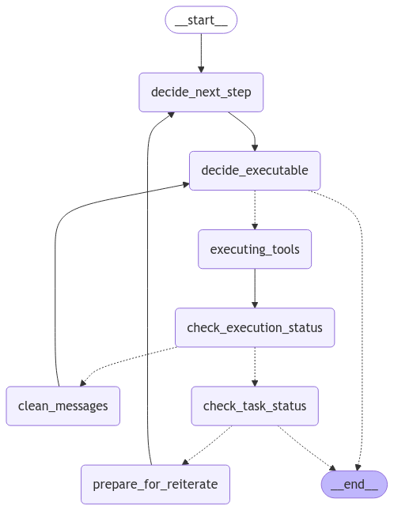
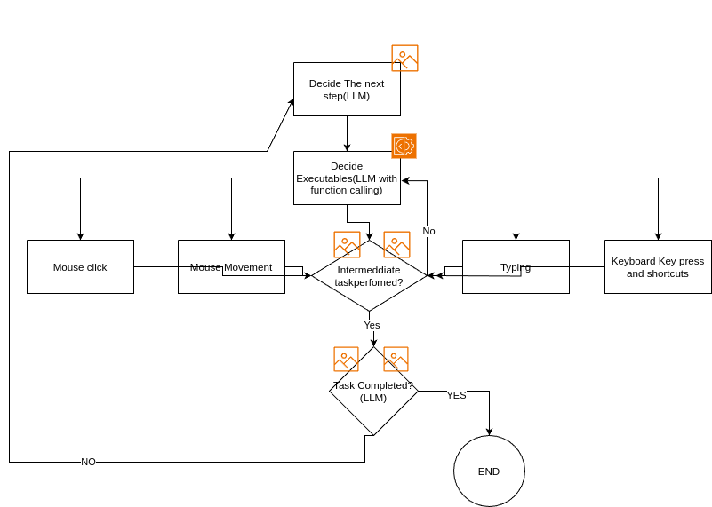

# 🗣️ VOX – Control Linux with Voice Commands

VOX is an AI-powered voice assistant for Linux that allows you to control your system using plain English voice commands. From managing files to navigating the UI with your voice, VOX makes human-computer interaction seamless and hands-free.



---

## 🚀 Features

- 🎙️ **Natural Language Voice Commands**: Speak in plain English to execute system actions.
- 🖱️ **Full Mouse & Keyboard Control**: Automate clicks, typing, navigation, and more.
- 🛎️ **Wake Word Detection**: Activate VOX by saying **"Hey, Vox"** anytime.
- 🧠 **Smart Visual Understanding**: Identifies on-screen icons and buttons using **Microsoft OmniParser**.
- 🧩 **Modular Graph Architecture**: Built with a bi-directional graph and decoupled nodes following the *Separation of Concerns* principle.
- 👁️ **Vision-based Action Completion**: Uses a vision model to verify successful action execution.

---

## 🧱 Tech Stack

| Technology        | Purpose                                      |
|-------------------|----------------------------------------------|
| [LangGraph](https://github.com/langchain-ai/langgraph)  | Node-based conversational flow           |
| [LangChain](https://www.langchain.com/) | LLM orchestration                        |
| [GPT-4o / GPT-4V](https://openai.com/)  | Language & vision intelligence           |
| [Microsoft OmniParser](https://huggingface.co/microsoft/OmniParser) | Visual UI understanding |
| [Python 3.11.10](https://www.python.org/) | Core language for scripting & logic     |

---

## ⚙️ Getting Started

### 1. Environment Setup

```bash
# Create and activate a new Python environment
python3 -m venv vox-env
source vox-env/bin/activate  # On Windows use: vox-env\Scripts\activate
## or conda create ...

# Install dependencies
pip install -r requirements.txt
```

### 2. Environment Variables

Create a `.env` file in the root directory and add the following:

```env
PICOVOICE_ACCESS_KEY=your-picovoice-access-key       # Get it from https://picovoice.ai/
OPENAI_API_KEY=your-openai-api-key                   # https://platform.openai.com/
LANGCHAIN_API_KEY=your-langchain-api-key             # Optional, for LangChain tracing
```

### 3. Start Microsoft Omni Parser

- Download the **OmniParser** weights from the official [Hugging Face repository](https://huggingface.co/microsoft/OmniParser).
- Place the downloaded files in the following directory structure:

```
static/weights/
├── icon_caption_blip2/
├── icon_caption_florence/
├── icon_detect/
├── config.json
└── convert_safetensor_to_pt.py
```

- Then, start the Omni Parser using:

```bash
python omniparser_watchdog.py
```


### 4. Start VOX

Open a **new terminal window** and run:

```bash
python main.py
```

---

## 🗂️ Usage Guide

Once VOX and Microsoft Omni are running, simply say:

> **"Hey Vox"**

This wakes the assistant. Then you can issue commands like:

- `"Delete test.txt located on my desktop."`
- `"Open Chrome and play Bonita song by Honey Singh on YouTube."`
- `"Empty the Recycle Bin."`
- `"Shutdown my system."`
- and many more...

🛑 **Note**: Ensure microphone access is enabled.

---

## 📷 Flow Diagram



The system follows a **bi-directional LangGraph** architecture with distinct functional nodes, allowing for modular design and improved maintainability.

---

## 🛠️ Contribution

Want to improve VOX? Contributions are welcome!

1. Fork the repo
2. Create a new branch (`git checkout -b feature-name`)
3. Commit your changes (`git commit -am 'Add new feature'`)
4. Push to the branch (`git push origin feature-name`)
5. Open a Pull Request

---

## 📄 License

MIT License. See `LICENSE` file for details.

---

## 🙏 Acknowledgements

- OpenAI for GPT-4o and GPT-4V
- Microsoft for Omni Vision Model
- LangChain & LangGraph community

---
## ⭐ Star this Project

If you find this project useful or interesting, please consider giving it a ⭐ on [GitHub](https://github.com/ishanExtreme/vox-bot). It helps others discover the project and motivates us to keep improving it!

[](https://github.com/ishanExtreme/vox-bot)

> VOX – Built to make your Linux experience conversational, intelligent, and hands-free.